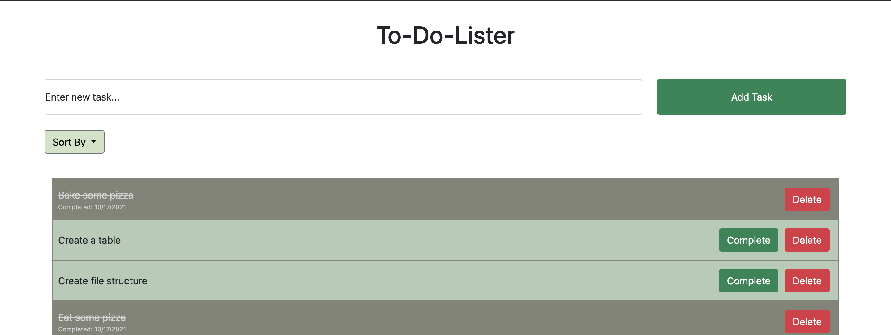

# To-Do-Lister

## Description

_Duration: Weekend Challenge_

This app is a (traditional) to-do-list app. Users can enter tasks (by pressing Enter or clicking on the "Add Task" button), mark tasks complete by clicking a button, and delete tasks by clicking on a delete button. Clicking on the delete button for completed tasks will simply delete the selected task, but clicking on an incomplete task will bring up a modal window asking the user to confirm the deletion.

The tasks persist on a PostgreSQL database. Completed tasks are timestamped and display the date completed to the user. Completed tasks are also presented with a different color, gray text, and line-through so the user can distinguish between completed and incomplete tasks. In addition, the user can sort the tasks according to alphabetical order (ascending or descending) and date completed (ascending or descending).

The app is styled using Bootstrap 5 and is responsive. The input field for entering a new task and its associated submit button persists at the top of the page (it's sticky) so that users can easily add more tasks.

## Screenshot

## Prerequisites

- [Node.js](https://nodejs.org/en/)
- [Express](https://expressjs.com/)
- [jQuery](https://jquery.com/)
- [PostgreSQL](https://www.postgresql.org/)

## Installation

1. After cloning this repository, set up a PostgreSQL database called `weekend-to-do-app` on port 5432. You might want to use [Postico](https://eggerapps.at/postico/) as a GUI to help this setup process.
2. Use the commands in the `database.sql` file in the root directory of the project to set up a table in the database with some dummy data.
3. Run `npm install` to install dependencies in this project.
4. Run `npm start` to start the server, which will run on port 5000.
5. Open up `localhost:5000` in your browser to view and use the app.

## Usage

1. Enter a new task by clicking on the "Enter new task..." input field and entering the task.
2. Either press Enter or click on the "Add Task" button to submit add the task to the list.
3. To mark a task as completed, click the "Complete" button (that only displays on incomplete tasks).
4. To delete a task from the list, click on the "Delete" button. For completed tasks, clicking this button will immediately delete the tasks. For incomplete tasks, a confirmation modal will pop up - click "OK" to confirm that you want to delete the task.
5. To sort by either alphabetical order or date completed, click on the "Sort By" dropdown menu above the list of tasks.
   - Selecting "Date completed (ascending)" will display all the completed tasks on top, in the order in which they were completed.
   - Selecting "Date completed (descending)" will place all incomplete tasks at the top of the list, with the completed tasks listed in descending order of completion at the bottom of the list.

## Built With

1. Node.js
2. Express
3. jQuery
4. PostgresQL
5. HTML
6. CSS

## Acknowledgement

Thanks to [Prime Digital Academy](www.primeacademy.io) who equipped and helped me to make this application a reality.
